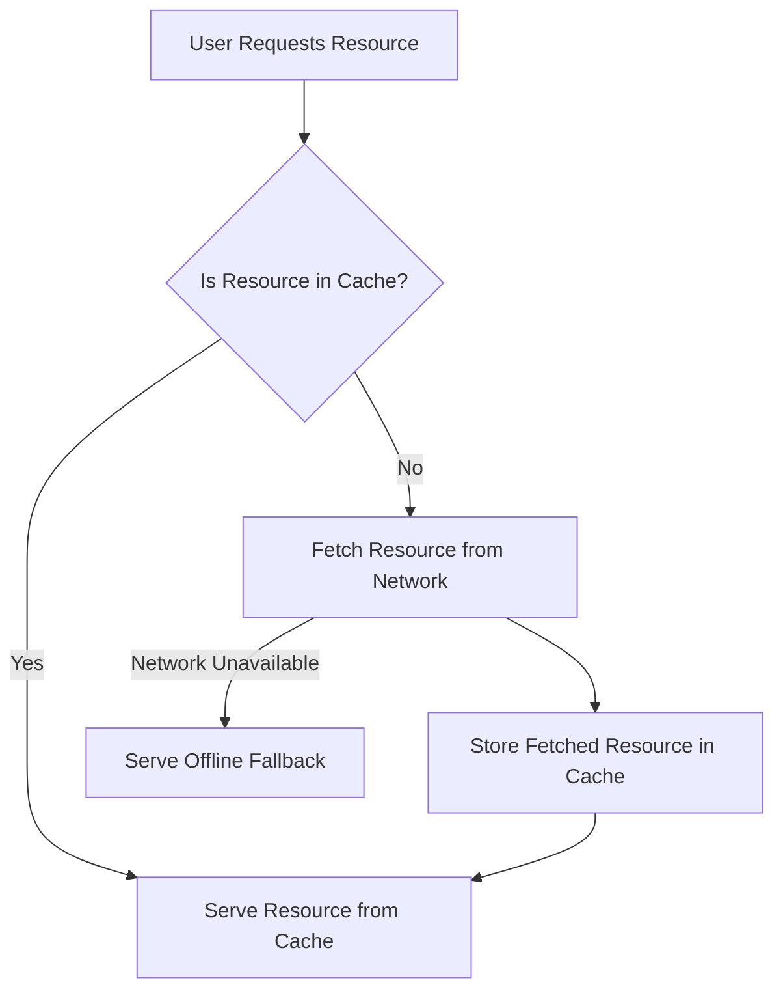

# Caching Data and Offline Access

To cache data and enable offline access in a Progressive Web App (PWA), you can use the Cache API and Service Workers. Here is a basic example:

## How Cache Works in Service Worker

Below is a diagram that illustrates how caching works in a Service Worker:



This diagram shows the flow of how a Service Worker handles resource requests by checking the cache first, fetching from the network if not cached, and serving an offline fallback if the network is unavailable.

## Step 1: Register a Service Worker

Create a `service-worker.js` file and register it in your main JavaScript file.

```javascript
if ('serviceWorker' in navigator) {
    window.addEventListener('load', () => {
        navigator.serviceWorker.register('/service-worker.js').then(registration => {
            console.log('ServiceWorker registration successful with scope: ', registration.scope);
        }, err => {
            console.log('ServiceWorker registration failed: ', err);
        });
    });
}
```

## Step 2: Install and Cache Resources

In your `service-worker.js` file, cache the necessary resources during the install event.

```javascript
self.addEventListener('install', event => {
    event.waitUntil(
        caches.open('my-cache').then(cache => {
            return cache.addAll([
                '/',
                '/index.html',
                '/styles.css',
                '/script.js',
                '/offline.html'
            ]);
        })
    );
});
```

## Step 3: Fetch Cached Resources

Intercept network requests and serve cached resources if available.

```javascript
self.addEventListener('fetch', event => {
    event.respondWith(
        caches.match(event.request).then(response => {
            return response || fetch(event.request);
        }).catch(() => {
            return caches.match('/offline.html');
        })
    );
});
```

## Step 4: Update Cache

Optionally, update the cache when new versions of resources are available.

```javascript
self.addEventListener('activate', event => {
    const cacheWhitelist = ['my-cache'];
    event.waitUntil(
        caches.keys().then(cacheNames => {
            return Promise.all(
                cacheNames.map(cacheName => {
                    if (!cacheWhitelist.includes(cacheName)) {
                        return caches.delete(cacheName);
                    }
                })
            );
        })
    );
});
```

This setup will cache your app
and make it available offline. Remember to test your PWA thoroughly to ensure that it works as expected in both online and offline scenarios.

## Additional Tips

- **Versioning Cache**: Use versioned cache names (e.g., `my-cache-v1`) to manage updates more effectively.
- **Cache Storage Limits**: Be mindful of storage limits imposed by browsers and clean up old caches to free up space.
- **Fallback Strategies**: Implement fallback strategies for different types of resources (e.g., images, API responses) to enhance user experience.
- **Security**: Always serve your PWA over HTTPS to ensure security and integrity of the content.

By following these steps and tips, you can create a robust caching strategy for your PWA, providing a seamless offline experience for your users.


