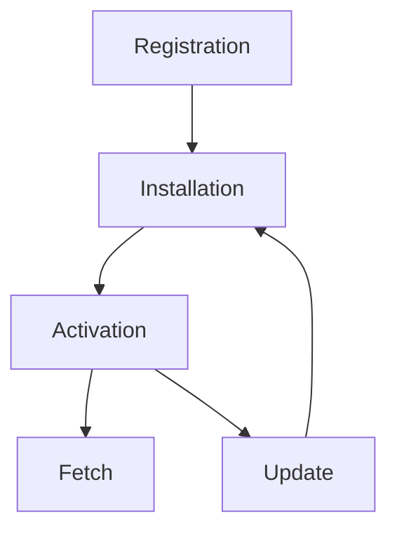

## Service Workers

### What is a Service Worker?

A Service Worker is a script that runs in the background, separate from your web page, enabling features that don't need a web page or user interaction. They are a key technology behind Progressive Web Apps (PWAs).

### Advantages of Service Workers

1. **Offline Support**: Service Workers can cache resources, allowing web applications to function offline or in poor network conditions.
2. **Background Sync**: They can synchronize data in the background, ensuring that user actions are sent to the server even if the user is offline at the time.
3. **Push Notifications**: Service Workers enable push notifications, allowing web applications to send updates to users even when the application is not open.
4. **Performance Improvements**: By caching resources, Service Workers can significantly improve the load times of web applications.

### Lifecycle of a Service Worker

1. **Registration**: The Service Worker is registered using JavaScript. This tells the browser where the Service Worker file is located.
2. **Installation**: The Service Worker is installed. During this phase, you can cache static assets.
3. **Activation**: Once installed, the Service Worker is activated. This is where you can clean up old caches from previous versions.
4. **Fetch**: The Service Worker can intercept network requests and serve cached resources, or fetch new ones from the network.
5. **Update**: The Service Worker can be updated with new code. The new Service Worker will go through the install and activate phases again.

### Lifecycle Diagram



### Example of Registering a Service Worker

```javascript
if ('serviceWorker' in navigator) {
    navigator.serviceWorker.register('/service-worker.js')
        .then(function(registration) {
            console.log('Service Worker registered with scope:', registration.scope);
        }).catch(function(error) {
            console.log('Service Worker registration failed:', error);
        });
}
```

### Detailed Steps for Installation

1. **Service Worker File**: Ensure you have a Service Worker file (e.g., `service-worker.js`) in your project.
2. **Install Event**: The Service Worker fires an `install` event. This is an opportunity to cache static assets.
3. **Cache Resources**: During the install event, you can open a cache and add the files you want to cache.
4. **Wait Until**: Use `event.waitUntil` to ensure the install event doesn't complete until the caching is done.

### Example of Installation

```javascript
self.addEventListener('install', event => {
    console.log('Service Worker installing...');
    event.waitUntil(
        caches.open('my-cache').then(cache => {
            return cache.addAll([
                '/',
                '/index.html',
                '/styles.css',
                '/script.js',
                '/image.png'
            ]);
        })
    );
});
```


### Detailed Steps for Activation

1. **Wait for Installation to Complete**: The browser waits for the installation phase to complete before moving to activation.
2. **Activate Event**: The Service Worker fires an `activate` event. This is an opportunity to clean up any old caches or perform other tasks that should only happen once the new Service Worker is in control.
3. **Claim Clients**: Optionally, the Service Worker can take control of all the pages under its scope immediately using `self.clients.claim()`.
4. **Ready to Control Pages**: Once activated, the Service Worker is ready to control pages and handle fetch events.

### Example of Activation

```javascript
self.addEventListener('activate', event => {
    console.log('Service Worker activating...');
    event.waitUntil(
        caches.keys().then(cacheNames => {
            return Promise.all(
                cacheNames.map(cache => {
                    if (cache !== currentCacheName) {
                        console.log('Deleting old cache:', cache);
                        return caches.delete(cache);
                    }
                })
            );
        }).then(() => {
            return self.clients.claim();
        })
    );
});
```
